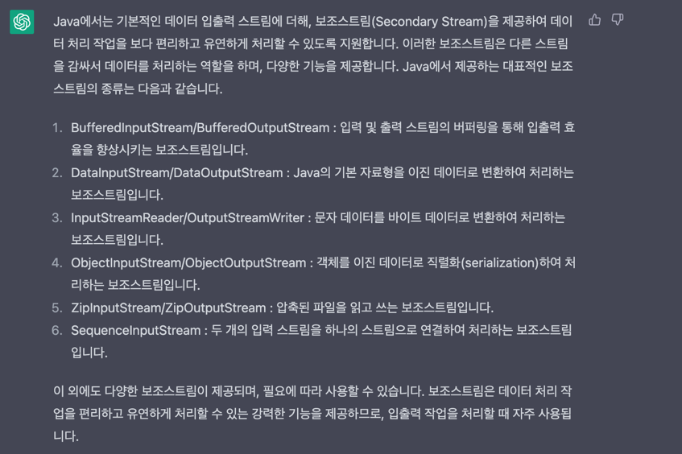
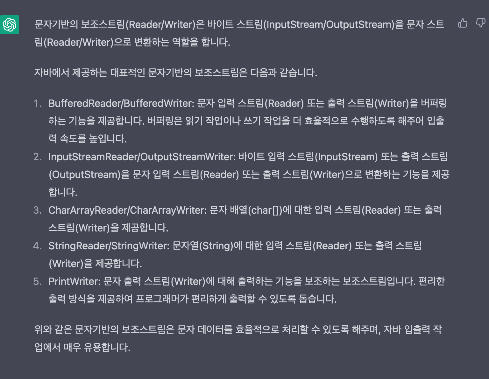

# 자바의정석

### 자바에서의 입출력
 - 입출력이란 : I/O란 Input과 Output의 약자로 입력과 출력, 간단히 줄여서 입출력이라고 한다.
 - 입출력은 컴퓨터 내부 또는 외부의 장치와 프로그램간의 데이터를 주고받는 것을 말한다.

### 스트림(stream)
 - 자바에서 입출력을 수행하려면, 한쪽에서 다른쪽으로 데이터를 전달하려면, 두 대상을 연결하고 데이터를 전송할 수있는 무언가가 필요한데 이것을 스트림
 - 스트림이란 데이터를 운반하는데 사용되는 연결통로이다.
 - 스트림은 단방향통신만 가능 그래서 입력과 출력을 동시에 수행하려면 입력을위한 input stream, 출력을위한 output stream 2개의 스트림이 필요하다.

### 바이트 기반 스트림 - InputStream, OutputStream
 - FileInputStream, FileOutputStream : 파일
 - ByteInputStream, ByteOutputStream : 메모리 (byte배열)
 - PipedInputStream, PipedOutputStream : 프로세스 (프로세스간의 통신)
 - read()의 반환타입이 btye가 아니고 int인 이유는 반환값 범위가 0~255 -1임
 - ByteArrayInputStream과 같이 메모리를 사용하는 스트림과 System.in out, 과 같은 표준 입출력 스트림은 닫아 주지 않아도 된다. close()

### 보조 스트림
 - 스트림의 기능을 보완하기 위한 보조스트림이 제공된다. 보조스트림은 실제 데이터를 주고받는 스트림이 아니기 때문에 데이터를 입출력할 수 있는 기능은없다.
 - 스트림의 기능을 향상시키거나 새로운 기능을 추가할 수 있다. 보조스트림만으로는 입출력 처리 X, 스트림을 생성한다음에 이를 이용해서 보조스트림을 생성한다.
 - 입력성능을 향상시키기위해 버퍼를 사용하는 보조스트림인 BufferedInputStream을 사용한다.

### 문자기반 스트림 Reader, Writer
 - 위에 스트림은 바이트기반 스트림 바이트기반이라함은 입출력 단위가 1byte, 자바에서 한문자를 의미하는 char는 2byte때문에 바이트기반의 스트림으로는 어렵다.
 - 문자데이터를 입출력할때는 바이트기반스트림 대신 문자기반 스트림을 사용한다.
 - InpuStream -> Reader / OutputStream -> Writer
 - FileReader, CharArrayReader, StringReader (xxxWriter도 동일)
 - 보조스트림 역시 문자기반 보조스트림이 존재하며 사용목적과 방식은 바이트기반 보조스트림과 다르지 않음.

### ByteArrayInputStream과 ByteArrayOutputStream
 - ByteArrayInputStream/ByteArrayOutputStream은 메모리, 바이트배열에 데이터를 입출력 하는데 사용되는 스트림이다.
 - 주로 다른 곳에 입출력하기 전에 데이터를 임시로 바이트배열에 담아서 변환 등의 작업을 하는데 사용된다.

### FileInputStream / FileOutputStream
 - FileInputStream / FileOutputStream은 파일 입출력을 하기 위한 스트림이다. 

### BufferedInputStream
 - BufferedInputStream은 입력소스로 부터 버퍼 크기만큼의 데이터를 읽어다 자신의 내부 버퍼에 저장한다. 8K ~ 128K 정도가 적당
 - 버퍼가 크면 입출력 속도가 빨라지지만 메모리를 사용량이 늘어난다.
 - 보조스트림을 사용한 경우에는 기반스트림의 close나 flush를 호출할 필요없이 단순히 보조스트림의 close를 호출하기만 하면 된다.

